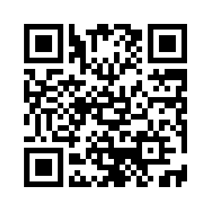

## Project description

Lots of coffee shops, especially those in major cities, are having trouble with their operating efficiency during busy hours. This is an app designed for the cashiers in coffee shops, for recording some feature data of the customers when taking orders, aiming to help coffee shop owners to identify and improve the weak links in their operations.

### Functionality

The stopwatch on top allows the cashiers to record the time each customer spends on deciding their order, followed by which is an input bar for entering the number of drinks in each order. During each order, the cashiers should input both of the above data and click the "submit" button to record them. The recorded data set will be displayed in the following data form. To clear the memories, simply click the "reset" button at the bottom.

### Benefits

This app is very intuitive and easy to use. It demands little extra work from the cashiers, and provides key data for the owners to analyse the operations of their coffee shops. The data recorded are useful for identifying certain trends and calculating correlations.

### App deployment

Link to the [Heroku CLI](https://cc-coffeetawk.herokuapp.com)

For deployment on mobile phones, scan: 

 

